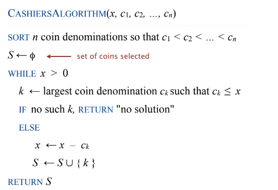

Created: 202501070112
Tags: 

## coin changing

#### Cashier's algorithm
At each iteration, add coin of the largest value that does not take us past the amount to be paid

## interval scheduling

## scheduling to minimize lateness

## optimal caching

## Dijkstra's algorithm
## minimum spanning trees
## Prim, Kruskal, Boruvka
## single-link clustering
## min-cost arborescences

-----
## References
1.
