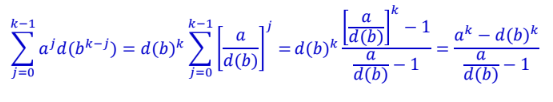
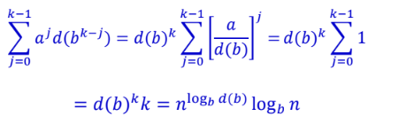

Created: 202501062342
Tags: 

## Đánh giá độ phức tạp thuật toán các chương trình đệ quy
### Phân tích
Với các chương trình đệ quy có gọi có chương trình đệ quy con, cần thành lập các phương trình đệ quy -> giải phương trình -> nghiệm phương trình chính là thời gian thực hiện chương trình đệ quy

```
Note
- đệ quy lưu vào bộ nhớ stack
- pp lặp nhanh hơn đệ quy vì không cần lưu vào ngăn xếp và lấy ra => ưu tiên dùng pp lặp khi có thể
```
### Thành lập phương trình đệ quy
- Phương trình đệ quy là phương trình biểu diễn mối liên hệ giữa T(n) và T(k)
	- T(n) : thời gian thực hiện chương trình với kích thước dữ liệu đầu vào là n
	- T(k) : thời gian thực hiện chương trình với kích thước dữ liệu đầu vào là k với k < n
- Để thành lập phương trình, phải căn cứ vào chương trình
- Ví dụ
	- Xét hàm tính giai thừa
		```
		int GiaiThua(int n){
			if(n == 0) return 1;
			else return n * GiaiThua(n - 1);
		}
		```
		- T(n) thời gian thực hiện tính n giai thừa
		- T(n-1) thời gian thực hiện tính n-1 giai thừa
		- T(0) = $C_1$ với n>0, gọi đệ quy tốn T(n-1)
		- Thao tác nhân n với kết quả đệ quy là $C_2$
		- Phương trình đệ quy: $T(n) = \begin{cases} C_1 &\text{if } n = 0 \\ T(n-1) + C_2 &\text{if } n > 0 \end{cases}$
	- Thuật toán merge sort
		- T(n) thời gian thực hiện sắp xếp trộn n phần tử
		- T(n/2) thời gian thực hiện sắp xếp trộn n/2 phần tử
		- $C_1$ : thời gian sắp xếp danh sác có độ dài 1
		- Với n>1, chia danh sách gồm 2 nửa và trộn -> tổn thời gian: $C_2n$ 
		- Phương trình đệ quy: $T(n) = \begin{cases} C_1 &\text{if } n = 1 \\ 2T(n/2) + C_2n &\text{if } n > 1 \end{cases}$
			%20=%20\begin{cases}%20C_1%20&\text{if%20}%20n%20=%201\\%202T(n/2)%20+%20C_2n%20&\text{if%20}%20n%20>%201%20\end{cases})
### Giải phương trình đệ quy
#### Phương pháp truy hồi
- Dùng đệ quy để thay thế bất kỳ T(m) với m<n vào phía phải của pt cho đến khi tất cả T(m) với m > 1 được thay thế bởi biểu thức của các T(1)
- T(1) luôn là hằng -> công thức của T(n) chứa các số hạng chỉ liên quan đến n và các hằng số
- Giải phương trình đệ quy: $T(n) = \begin{cases} C_1 &\text{if } n = 1 \\ 2T(n/2) + C_2n &\text{if } n > 1 \end{cases}$
	%20=%20\begin{cases}%20C_1%20&\text{if%20}%20n%20=%201\\%202T(n/2)%20+%20C_2n%20&\text{if%20}%20n%20>%201%20\end{cases})
	Ta có:
	$T(n) = 2T(\frac{n}{2}) + C_2n$ 
	$T(n) = 2(2T(\frac{n}{4}) + C_2\frac{n}{2}) + C_2n = 4T(\frac{n}{4}) + 2C_2n$ 
	$T(n) = 4(2T(\frac{n}{8}) + C_2\frac{n}{4}) + 2C_2n = 8T(\frac{n}{8}) + 3C_2n$
	$\to T(n) = 2^iT(n/2^i) + iC_2n$ 
	Giả sử: $n = 2^k \to k = logn$   
	quá trình suy rộng kết thúc khi `i = k`
	=> $T(n) = 2^kT(1) + kC_2n$
	với $T(1) = C_1 \space và \space k = logn$ 
	=> $T(n) = C_1n + C_2nlogn = nlogn$ 
	
#### Phương pháp đoán nghiệm
Dùng chứng minh quy nhạp để chứng tỏ rằng T(n) <= f(n) với mọi n
#### Lời giải tổng quát của 1 lớp phương trình đệ quy
- Để giải bài toán kích thước n
	- chia thành `a` bài toán con
	- mỗi bài toán con có kích thước `n/b`
	Giải bài toán con này và tổng hợp kết quả để được kết quả bài toán đầu
	Đối với các bài toán con, lặp lại bước trên -> đệ quy

- Giả sử
	- mỗi bài toán con có `kích thước 1` lấy một đơn vị thời gian
	- `d(n)` là thời gian để chia bài toán kích thước n thành các bài toán con kích thước `n/b` 
	Gọi `T(n)` là thời gian để giải bài toán kích thước `n`
	Ta có pt đệ quy: $\begin{cases} T(1) = 1 \\ T(n) = aT(\frac{n}{b}) + d(n) \end{cases}$  `(1)`
		hàm thời gian `d(n)` dgl hàm tiến triển
	
	Sử dụng pp truy hồi giải pt 
	- $T(n) = aT(\frac{n}{b}) + d(n)$ 
	- $T(n) = a[aT(n/b^2) + d(n/b)] + d(n)$ 
		$= a^2T(n/b^2) + ad(n/b) + d(n)$  
	- $T(n) = a^2[aT(n/b^3) + d(n/b^2)] + ad(n/b) + d(n)$
		$= a^3T(n/b^3) + a^2d(n/b^2) + ad(n/b) + d(n)$ 
		= ...
		$= a^iT(n/b^i) + 	\textstyle\sum_{i=0}^{i-1}a^id(n/b^i)$ 
	
	Giả sử $n = b^k$ 
	=> $T(n/b^k) = T(1) = 1$ 
	Thay `i = k` vào trên: $T(n) = a^k + \textstyle\sum_{j=0}^{k-1}a^jd(b^{k-j})$   `(2)`  (khong hieu dong nay)
	- $a^k = n^{log_ba}$ : nghiệm thuần nhất
		- là nghiệm chính xác khi `d(n) = 0` với mọi n
		- biểu diễn thời gian để giải tất cả bài toán con
	-  $\textstyle\sum_{j=0}^{k-1}a^jd(b^{k-j})$ : nghiệm riêng
		-  biểu diễn thời gian phải trả để tạo các bài toán con và tổng hợp kết quả của chúng
		- **phụ thuộc vào hàm tiến triển, số lượng và kích thước bài toán con**
	
	Tìm nghiệm pt `(1)`: Tìm nghiệm riêng và so sánh với nghiệm thuần nhất, nghiệm lớn hơn là nghiệm của pt
	
	Hàm nhân: `f(m.n) = f(m).f(n)`
		Nếu `d(n)` trong `(1)` là hàm nhân thì
		- $d(b^{k-j}) = d(b)^{k-j}$  
		- nghiệm riêng của `(2)`
			
	- Xét 3 TH
		- `a > d(b)` : $O(a^k) = O(n^{log_ba})$ 
			- nghiệm riêng = nghiệm thuần nhất: $T(n) = O(n^{log_ba})$
			- thời gian thực hiện chỉ phụ thuộc a và b, không phụ thuộc `d(n)`
				-> để cải thiện thuật toán cần `giảm a tăng b`
		- `a < d(b)` : $O(d(b)^k) = O(n^{log_bd(b)})$ 
			- nghiệm riêng > nghiệm thuần nhất: $T(n) = O(n^{log_bd(b)})$
			- TH đặc biệt: $d(n) = n^\alpha \to d(b) = b^\alpha$  và  $log_b(b^\alpha) = \alpha$   -> nghiệm riêng là $O(n^\alpha)$ và $T(n) = O(n^\alpha)$  
		- `a = d(b)` : công thức nghiệm riêng hàm nhân không xác định -> tính trực tiếp nghiệm riêng
			
			-  nghiệm riêng: $n^{log_ba}log_bn$ 
			- $T(n) = O(n^{log_ba}log_bn)$
			- Đặc biệt: $d(n) = n^\alpha \to T(n) = O(n^\alpha logn)$  

- Giari 1 pt cụ thể
	- Dạng có thuộc dạng pt tổng quát không
	- Nếu có xem hàm tiến triển có phải hàm nhân không
	- Nếu có thì xác định `a, d(b)` và so sánh để vận dụng 1 trong 3 TH trên

- `Ví dụ: giải các pt đệ quy với T(1) = 1`
	1. $T(n) = 4T(n/2) + n$
	2.  $T(n) = 4T(n/2) + n^2$
	3.  $T(n) = 4T(n/2) + n^3$ 
	Giai
	Với mỗi trường hợp: a = 4, b = 2 và nghiệm thuần nhất là $n^{log_24} = n^2$ 
	1. `d(n) = n -> d(b) = 2`
		Vì a = 4 > d(b) = 2 
		=> nghiệm riêng cũng là $n^2$
		=> $T(n) = O(n^2)$
	2. `d(n) = n^2 -> d(b) = 4 = a` -> $T(n) = O(n^2logn)$ 
	3. `d(n) = n^3 -> d(b) = 8`
		vì a < d(b)
		-> nghiệm riêng: $O(n^{log_bd(b)}) = O(n^{log_28}) =O(n^3)$
		-> $T(n) = O(n^3)$ 
	
	`Note: d(b) là giá trị của d(n) khi thay n bằng b`

### Master theorem
- Dùng để giải các pt đệ quy có dạng:
	`T(n) = aT(n/b) + f(n), với a >= 1 và b > 1`
- Có 3 trường hợp
	Nếu $f(n) = O(n^\alpha)$ và
	- $\alpha < log_ba \to T(n) = O(n^{log_ba})$
	- $\alpha = log_ba \to T(n) = O(n^\alpha logn)$ 
	- $\alpha > log_ba \to T(n) = O(f(n))$
- VD
	- `merge sort: T(n) = 2T(n/2) + O(n)` 
		-> TH2: $\alpha = log_ba = 1 \to T(n) = O(nlogn)$ 
	- `binary search: T(n) = T(n/2) + O(1)`
		-> TH2:  $\alpha = log_ba = 0 \to T(n) = O(logn)$ 

### Bài tập
Giải các phương trình đệ quy sau với T(1) = 1
1. `T(n) = 3T(n/2) + n`
	a = 3, b = 2
	d(n) = n  => d(b) = 2
	Cach 1: a > d(b)  =>  TH1:  $T(n) = O(n^{log_ba}) = O(n^{log_23})$ 
	Cach 2: $\alpha = 1$ , $log_ba = log_23 > 1$
		=> $\alpha < log_ba \to T(n) = O(n^{log_23})$ 
	
2. `T(n) = 3T(n/2) + n^2`
	a = 3, b = 2
	d(n) = n^2 => d(b) = 4
	a < d(b)  =>  $T(n) = O(n^{log_bd(b)}) = O(n^{log_24}) = O(n^2)$ 
	
3. `T(n) = 8T(n/2) + n^3`
	a = 8, b = 2
	d(n) = n^3  =>  d(b) = 8
	a = d(b)  => $T(n) = O(n^3logn)$ 
	
4. `T(n) = 4T(n/3) + n`
	
5. `T(n) = 4T(n/3) + n^2`
	
6. `T(n) = 9T(n/3) + n^2`
	
7. `T(n) = 2T(n/2) + n`
	
8. `T(n) = 2T(n/2) + n^2`
	
9. `T(n) = 2T(n/2) + logn`
	a = 2, b = 2
	d(n) = logn  => d(b) = 1
	a > d(b)  =>  $T(n) = O(n^{log_ba}) = O(n)$ 

-----
## References
1.
 